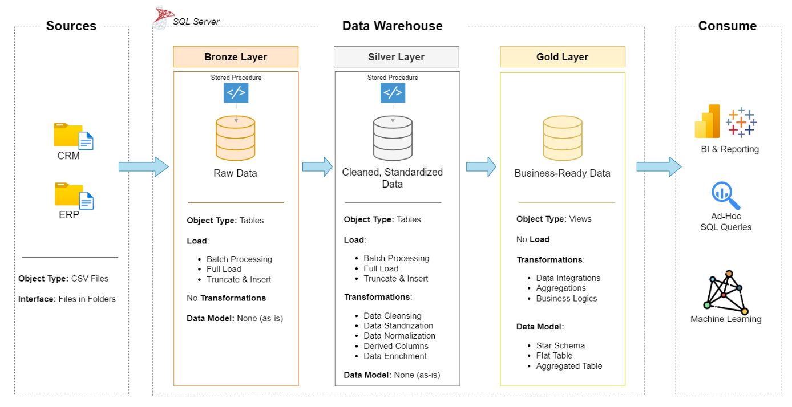

# Data Warehouse and Analytics Project

Welcome to my **Data Warehouse and Analytics Project** 🚀  
This project demonstrates an end-to-end **Data Engineering + Analytics** workflow — from raw data ingestion to a clean star schema and SQL-based insights.

It’s built as a **portfolio project**, showing real-world best practices in:
- Data Warehousing (Medallion Architecture)
- ETL Development
- Data Cleaning & Transformation
- Data Modeling (Star Schema)
- SQL Analytics & Reporting

---

## 🏗️ Data Architecture

This project follows the **Medallion Architecture** approach with **Bronze**, **Silver**, and **Gold** layers:



> Diagram reference: DataWithBaraa tutorial resources (used for learning/portfolio documentation).


### 🔸 Bronze Layer (Raw)
- Stores raw data exactly as received from source systems
- Data is ingested from **CSV files** into **SQL Server**
- No transformations are applied here

### ⚪ Silver Layer (Cleaned + Standardized)
- Cleans and prepares the data for analytics
- Handles:
  - Missing values
  - Duplicates
  - Standardization
  - Data type corrections
  - Basic normalization

### 🟡 Gold Layer (Business-Ready)
- Stores final curated data
- Modeled in a **Star Schema**
- Optimized for analytics, dashboards, and reporting

---

## 📖 Project Overview

This project includes:

1. **Data Architecture**
   - Designing a modern data warehouse using the Medallion approach (Bronze → Silver → Gold)

2. **ETL Pipelines**
   - Extracting raw data from multiple sources
   - Cleaning and transforming it
   - Loading it into a structured warehouse

3. **Data Modeling**
   - Designing Fact and Dimension tables
   - Building a reporting-ready star schema

4. **Analytics & Reporting**
   - SQL-based analysis and reporting for business insights

---

## 🎯 Skills Demonstrated

This repository highlights practical experience in:

- SQL Development (SQL Server)
- Data Warehousing
- ETL Pipeline Development
- Data Cleaning & Transformation
- Star Schema Modeling
- Data Analytics (SQL Reporting)

---

## 🛠️ Tools Used

All tools used are free:

- **SQL Server Express** (Database Engine)
- **SQL Server Management Studio (SSMS)** (GUI)
- **Draw.io** (Architecture + Modeling diagrams)
- **GitHub** (Version control + portfolio)

---

## 🚀 Project Requirements

### 🏗️ Data Warehouse (Data Engineering)

#### Objective
Build a modern data warehouse using SQL Server to consolidate sales data and enable analytical reporting.

#### Specifications
- **Data Sources:** Two source systems (ERP + CRM) provided as CSV files  
- **Data Quality:** Resolve quality issues before analysis  
- **Integration:** Merge both sources into one clean analytical model  
- **Scope:** Only latest dataset is required (no historization)  
- **Documentation:** Clear model documentation for analytics and stakeholders  

---

### 📊 BI Analytics & Reporting (Data Analysis)

#### Objective
Generate SQL-based insights for:
- Customer Behavior
- Product Performance
- Sales Trends

(Additional details are available in `docs/requirements.md`.)

---

## 📂 Repository Structure

```bash
data-warehouse-project/
│
├── datasets/                           # Raw datasets (ERP and CRM)
│
├── docs/                               # Documentation and diagrams
│   ├── etl.drawio                      # ETL techniques and process
│   ├── data_architecture.drawio        # Medallion architecture diagram
│   ├── data_catalog.md                 # Dataset metadata and field descriptions
│   ├── data_flow.drawio                # Data flow diagram
│   ├── data_models.drawio              # Star schema model diagram
│   ├── naming-conventions.md           # Naming rules for tables/columns
│
├── scripts/                            # SQL scripts for each layer
│   ├── bronze/                         # Raw ingestion scripts
│   ├── silver/                         # Cleaning & transformation scripts
│   ├── gold/                           # Star schema + reporting models
│
├── tests/                              # Data validation + quality checks
│
├── README.md                           # Project documentation
├── LICENSE                             # MIT License
├── .gitignore                          # Ignored files for Git
└── requirements.txt                    # Dependencies
```
---
## 📊 SQL Analytics Report

This repository includes a set of SQL queries built on the Gold Layer to generate business insights such as:

- Total sales summary
- Monthly and yearly sales trends
- Top customers and products
- Sales by country and category

You can find the script here:  
[reports/gold_summary_report.sql](reports/gold_summary_report.sql)

---
## 🙏 Credits

This project was built as a learning + portfolio implementation inspired by the **DataWithBaraa** Data Warehouse tutorial.

Datasets and reference diagrams were provided through the tutorial resources.

---

## 🛡️ License

This project is licensed under the **MIT License**.

---
## 👩‍💻 About Me

Hi! I’m **Mahalaxmi Somisetty**, an Information Technology student with a strong interest in:

- Data Engineering  
- SQL Development  
- Data Warehousing  
- Analytics and Reporting  

I enjoy building structured projects that simulate real-world workflows, and this repository is part of my learning + portfolio journey toward data roles.
